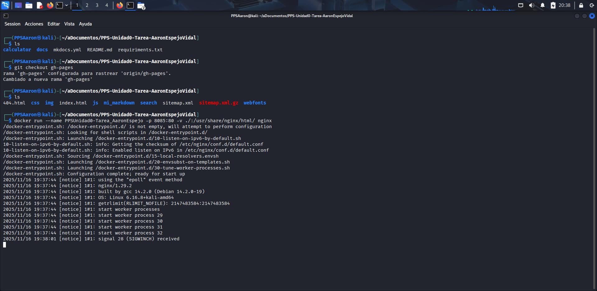
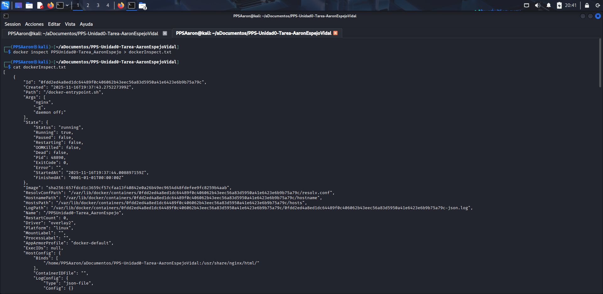

# Creación del contenedor docker de NGINX
## Creación del contenedor
Lo primero que he hecho ha sido cambiarme a la rama **gh-pages** para tener todos los archivos en mi repositorio local con el comando `git checkout gh-pages`, una vez hecho esto ya he creado el contenedor docker, en este caso he utilizado un contenedor normal, con el comando:
- `docker run --name PPSUnidad0-Tarea_AaronEspejo -p 8085:80 -v ./:/usr/share/nginx/html/ nginx`
    - `--name PPSUnidad0-Tarea_AaronEspejo`: Especifico el nombre del contenedor docker
    - `-p 8085:80`: Especifico que el puerto **80** del contenedor nginx sea redirigido al puerto **8085** de mi máquina anfitriona.
    - `-v ./:/usr/share/nginx/html/ nginx`: Especifico el volumen tipo **Bind-Mount**, en el que le digo a Docker que el contenedor Nginx utilice los archivos de la ruta actual la cual es la ruta de mi repositorio local.

**EN LA CAPTURA SE VEN LOS ARCHIVOS DEL PROYECTO ANTERIOR PORQUE COPIE LOS ARCHIVOS DEL ANTERIOR Y NO TENÍA LA RAMA gh-pages EN LOCAL ACTUALIZADA AL NUEVO PROYECTO, DESPUÉS LO ARREGLO Y SE PUEDE VER EN LA CAPTURA DE LA PÁGINA DE NGINX QUE FUNCIONA CORRECTAMENTE**

## Visualización de la página de Nginx
Como se puede ver en la captura accediendo a la dirección: http://localhost:8085 carga la página de Nginx

## Docker Inspect
En la imagen se puede ver parte del comando `docker inspect`, en este [enlace](../dockerInspect.txt)(El enlace funciona si lo ves desde Github, no desde github.io) está el documento con la salida del comando

