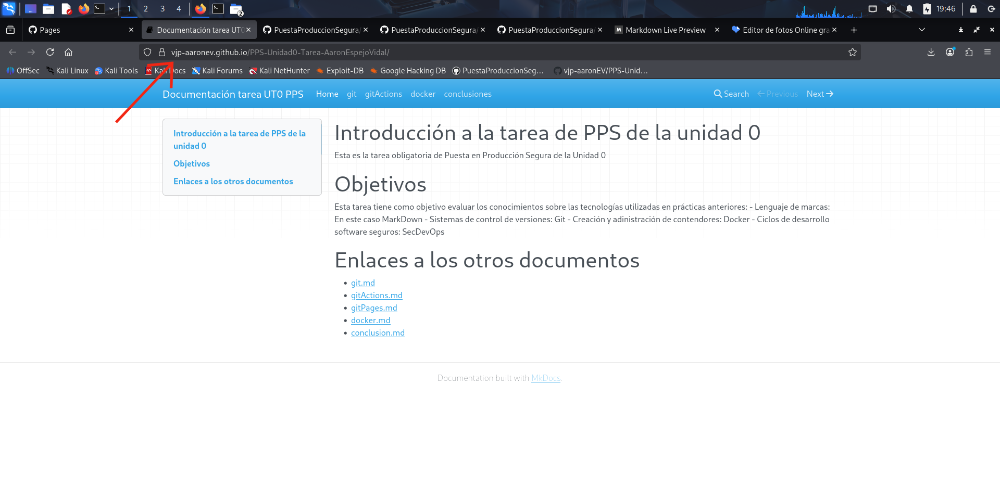

# Creación de Github Pages
Lo primero que tenemos que hacer es ir a la página de web de nuestro proyecto en Github, luego nos tenemos que ir al apartado de **'Settings - Pages'**, y dentro de este apartado tenemos que dejarlo así:
- Source: Deploy from a branch
- Branch: En este caso **'gh-pages'** y en la raíz **'/ (root)'**

Una vez que lo hayamos terminado de configurar tenemos que darle a **'Save'**.

Una vez hecho esto, si esperamos unos segundos (o minutos) y recargamos la página de Github, nos saldrá el enlace a nuestra página

Si le damos al enlace nos llevará al sitio:

